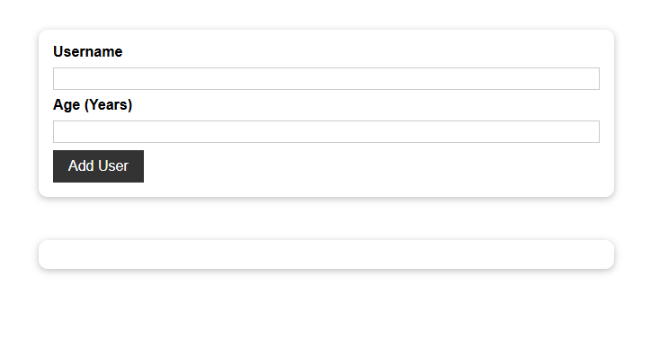
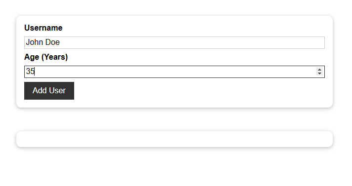
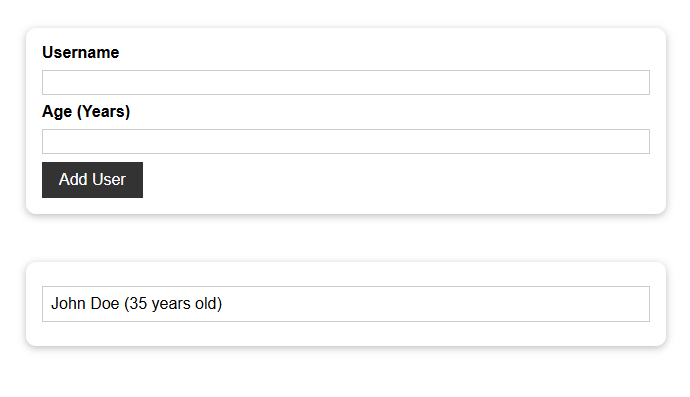

## Add User Project
>React app for adding users to a list.

* [User Interface](#add-user-ui)
* [File Structure](#add-user-file-structure)

### <a name="add-user-ui">User Interface</a>

Main landing page:



Adding a new user:



New user added to list of users:



### <a name="add-user-file-structure">File Structure</a>
```
add-user-project/
├── public/
    ├── index.html
    ├── favicon.ico
    ├── manifest.json
    └── robots.txt
├── src/
    ├── assets/
    |   ├── images/
    |   |   ├── ui-1.png
    |   |   ├── ui-2.png
    |   |   ├── ui-3.png
    ├── components/
    |   ├── Helpers/
    |   |   ├── Wrapper.js
    |   ├── UI/
    |   |   ├── Button.js
    |   |   ├── Button.module.css
    |   |   ├── Card.js
    |   |   ├── Card.module.css
    |   |   ├── ErrorModal.js
    |   |   ├── ErrorModal.module.css
    |   ├── Users/
    |   |   ├── AddUser.js
    |   |   ├── AddUser.module.css
    |   |   ├── UsersList.js
    |   |   ├── UsersList.module.css
    ├── App.js
    ├── index.css
    ├── index.js
├── .gitignore
├── package.json
├── readme.md
```

<kbd> <br> [Back to Top](#add-user-project) <br> </kbd>
---