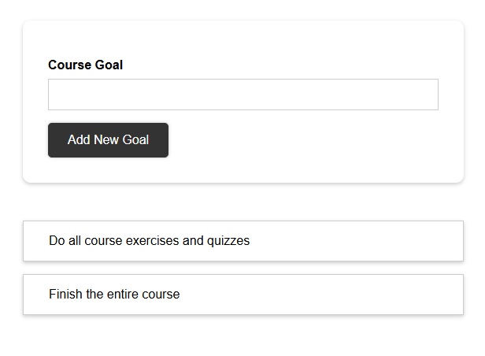
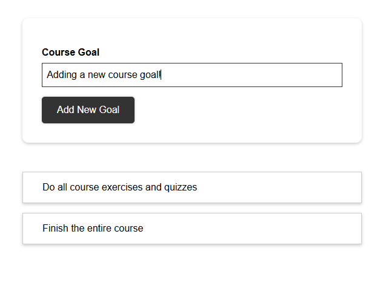
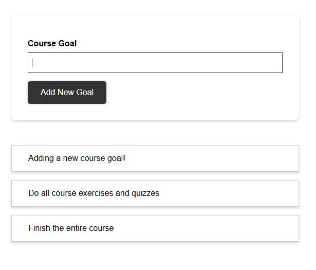

## Course Goal Project
>React app for adding course goals to a list.

* [User Interface](#course-goal-ui)
* [File Structure](#course-goal-file-structure)

### <a name="course-goal-ui">User Interface</a>

Main landing page:



Adding a new course goal:



New course goal added to list:



### <a name="course-goal-file-structure">File Structure</a>
```
course-goal-project/
├── public/
    ├── index.html
    ├── favicon.ico
    ├── manifest.json
    └── robots.txt
├── src/
    ├── assets/
    |   ├── images/
    |   |   ├── ui-1.png
    |   |   ├── ui-2.png
    |   |   ├── ui-3.png
    ├── components/
    |   ├── CourseGoals/
    |   |   ├── CourseGoalItem/
    |   |   |   ├── CourseGoalItem.css
    |   |   |   ├── CourseGoalItem.js
    |   |   ├── CourseGoalList/
    |   |   |   ├── CourseGoalList.css
    |   |   |   ├── CourseGoalList.js
    |   |   ├── CourseGoalInput/
    |   |   |   ├── CourseInput.js
    |   |   |   ├── CourseInput.module.css
    |   ├── UI/
    |   |   ├── Button/
    |   |   |   ├── Button.js
    |   |   |   ├── Button.module.css
    ├── App.css
    ├── App.js
    ├── index.css
    ├── index.js
├── .gitignore
├── package.json
├── readme.md
```

<kbd> <br> [Back to Top](#course-goal-project) <br> </kbd>
---
