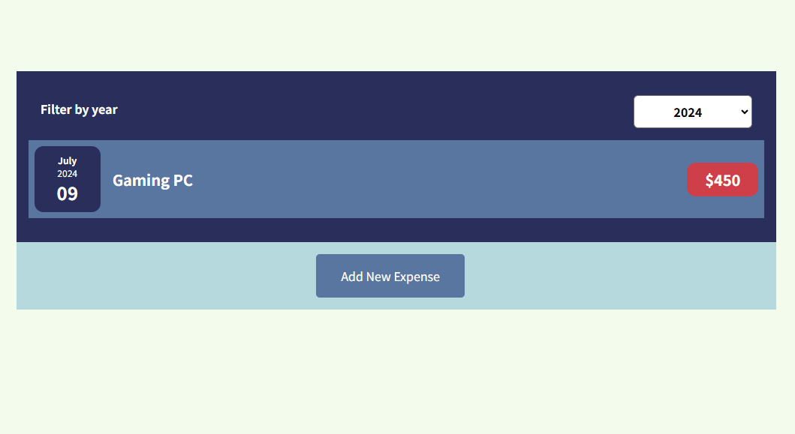
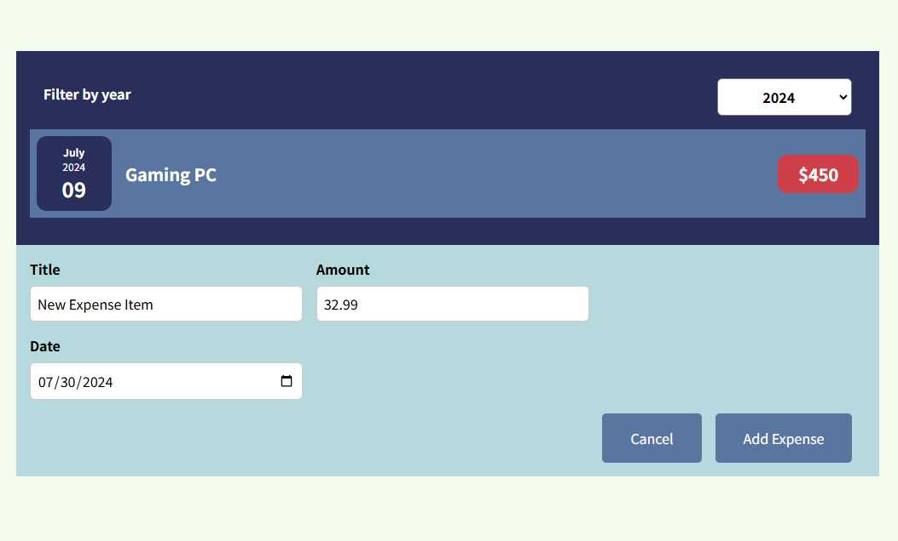

## Expense Tracker Project
>React app for keeping track of expenses.

* [User Interface](#expense-tracker-user-interface)
* [File Structure](#expense-tracker-file-structure)

### <a name="expense-tracker-user-interface">User Interface</a>

Main landing page:



Adding a new expense:



New expense added to expense list:


### <a name="expense-tracker-file-structure">File Structure</a>
```
expense-tracker-project/
├── public/
    ├── index.html
    ├── favicon.ico
    ├── manifest.json
    └── robots.txt
├── src/
    ├── assets/
    |   ├── images/
    |   |   ├── ui-1.png
    |   |   ├── ui-2.png
    |   |   ├── ui-3.png
    ├── components/
    |   ├── Expenses/
    |   |   ├── ExpenseDate.css
    |   |   ├── ExpenseDate.js
    |   |   ├── ExpenseItem.css
    |   |   ├── ExpenseItem.js
    |   |   ├── Expenses.css
    |   |   ├── Expenses.js
    |   |   ├── ExpensesFilter.css
    |   |   ├── ExpensesFilter.js
    |   |   ├── ExpensesList.css
    |   |   ├── ExpensesList.css
    |   ├── NewExpense/
    |   |   ├── ExpenseForm.css
    |   |   ├── ExpenseForm.js
    |   |   ├── NewExpense.css
    |   |   ├── NewExpense.js
    ├── App.js
    ├── index.css
    ├── index.js
├── .gitignore
├── package.json
├── readme.md
```

<kbd> <br> [Back to Top](#expense-tracker-project) <br> </kbd>
---