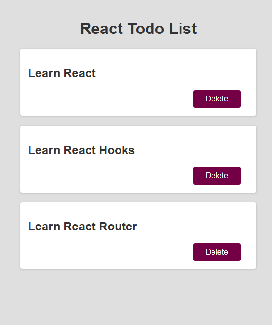
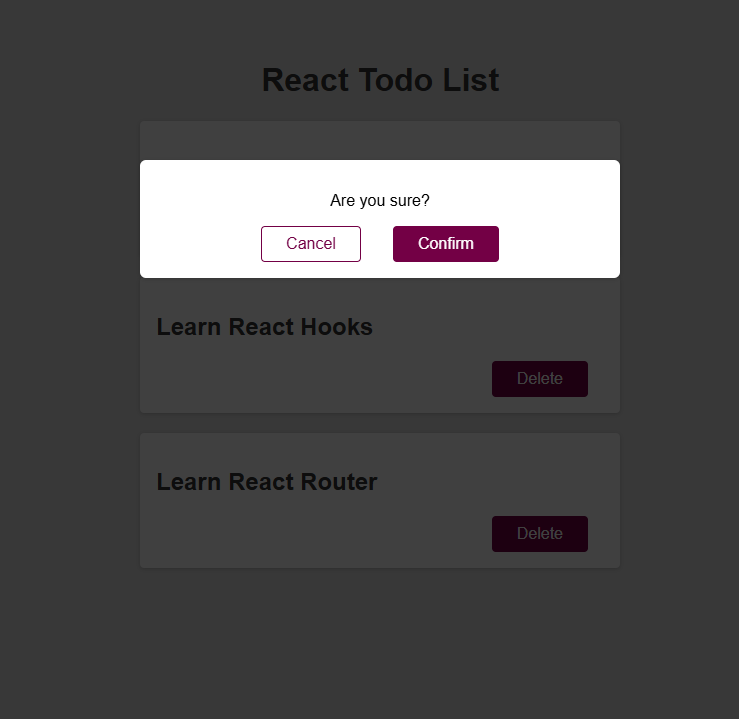

## Introduction Project
>Intro to getting started with React apps - a simple first project.

* [User Interface](#introduction-ui)
* [File Structure](#introduction-file-structure)
* [Full Code Breakdown](#introduction-code-breakdown)

### <a name="introduction-ui">User Interface</a>

Main landing page:



`Delete` button click modal page:



### <a name="introduction-file-structure">File Structure</a>
```
introduction-project/
├── public/
    ├── index.html
    ├── favicon.ico
    ├── manifest.json
    └── robots.txt
├── src/
    ├── assets/
    |   ├── images/
    |   |   ├── ui-1.png
    |   |   ├── ui-2.png
    ├── components/
    |   ├── Backdrop.js
    |   ├── Modal.js
    |   ├── Todo.js
    ├── App.js
    ├── index.css
    ├── index.js
├── .gitignore
├── package.json
├── readme.md
```

### <a name="introduction-code-breakdown">Full Code Breakdown</a>

> [!NOTE]
> This section does not cover all specific code blocks in `index.js` and `App.js`. For information on code in these files that is not covered, check out the [Base React project](/00-base-react) documentation.

---
**The `Backdrop.js` File:**
```js
function Backdrop(props) {
  return <div className='backdrop' onClick={props.onClick} />;
}

export default Backdrop;
```
**Key Points:**
* This component renders a `div` with a class of `backdrop`.
    * `className` is the attribute used to assign CSS classes to elements in JSX. It is the equivalent of the `class` attribute in HTML.
* It takes a prop called `onClick`, which is a function.
* When the `Backdrop` is clicked, it calls the `onClick` function passed from the parent component.
* The `Backdrop` component, in this example, is used to darken the screen background when a modal is displayed.

---
**The `Modal.js` File:**
```js
function Modal(props) {
  return (
    <div className='modal'>
      <p>{props.text}</p>
      <button className='btn btn--alt' onClick={props.onClose}>
        Cancel
      </button>
      <button className='btn' onClick={props.onClose}>
        Confirm
      </button>
    </div>
  );
}

export default Modal;
```
**Key Points:**
* Renders a `div` with a class of `modal`.
* Contains a paragraph displaying the `text` prop, and two buttons ("Cancel" and "Confirm"), both of which execute the `onClose` function passed as a prop when clicked.

---
**The `Todo.js` File:**
```js
import { useState } from 'react';

import Backdrop from './Backdrop';
import Modal from './Modal';

function Todo(props) {
  const [showModal, setShowModal] = useState();

  function showModalHandler() {
    setShowModal(true);
  }

  function closeModalHandler() {
    setShowModal(false);
  }

  return (
    <div className='card'>
      <h2>{props.text}</h2>
      <div className='actions'>
        <button className='btn' onClick={showModalHandler}>
          Delete
        </button>
      </div>
      {showModal && <Backdrop onClick={closeModalHandler} />}
      {showModal && <Modal text='Are you sure?' onClose={closeModalHandler} />}
    </div>
  );
}

export default Todo;
```
**Key Points:**
* Imports `Modal` and `Backdrop` components.
* Imports the React `usState` hook, which is used to manage and track state in functional components.
* In this example, `usState` is used to manage the `showModal` variable.
* Renders a `card` with a title (`props.text`) and a "Delete" button.
* Clicking the "Delete" button triggers the `showModalHandler`, setting `showModal` to `true` with:
    * `Backdrop` displayed - clicking it calls `closeModalHandler` to hide the modal. 
    * `Modal` displayed, asking the user for confirmation. Clicking either "Cancel" or "Confirm" also calls `closeModalHandler`.


> [!TIP]
> Check out the [State Management](/state-management/readme.md) section for more information on state in React applications.

---
**The `App.js` File:**
```js
import Todo from './components/Todo';

function App() {
  return (
    <div>
      <h1>React Todo List</h1>
      <Todo text='Learn React' />
      <Todo text='Learn React Hooks' />
      <Todo text='Learn React Router' />
    </div>
  );
}

export default App;
```
* Imports the `Todo` component.
* Renders the title "React Todo List" and a three `Todo` components.

<kbd> <br> [Back to Top](#introduction-project) <br> </kbd>
---