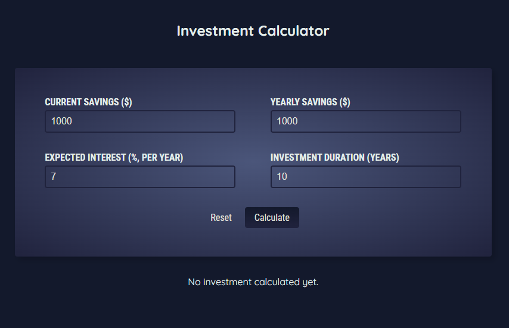
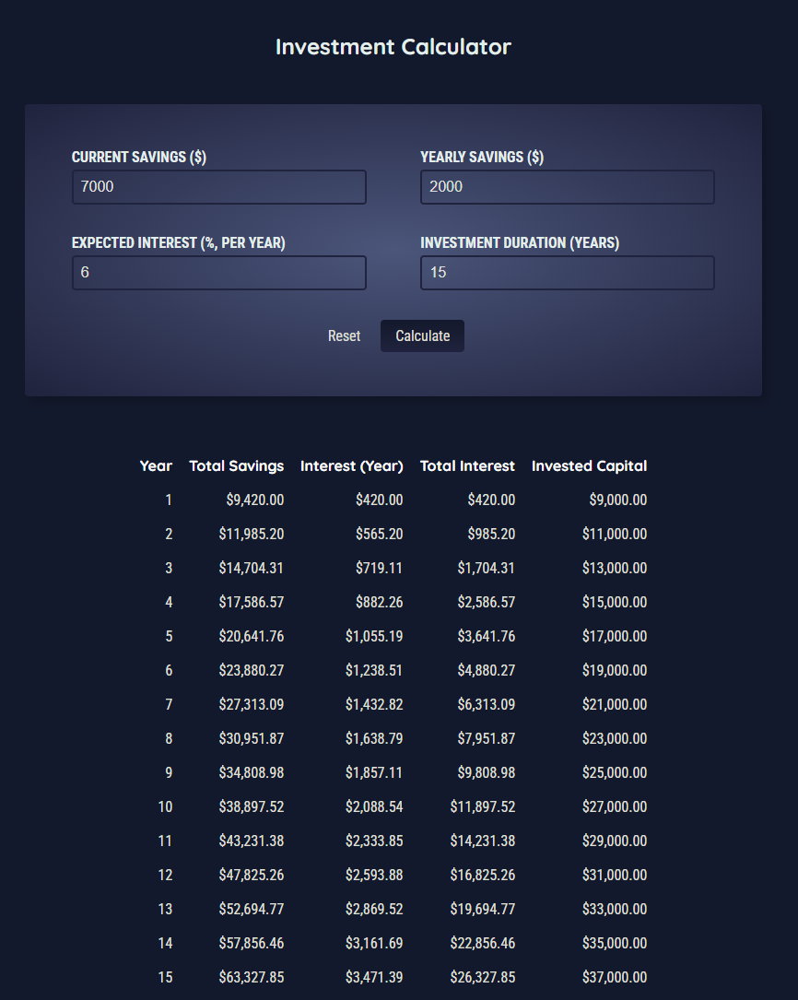
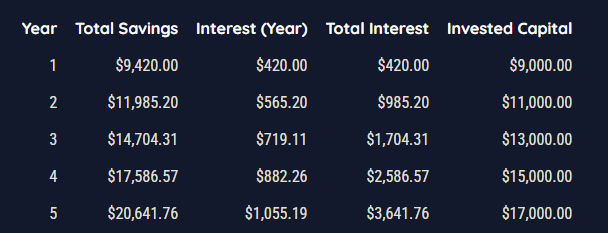
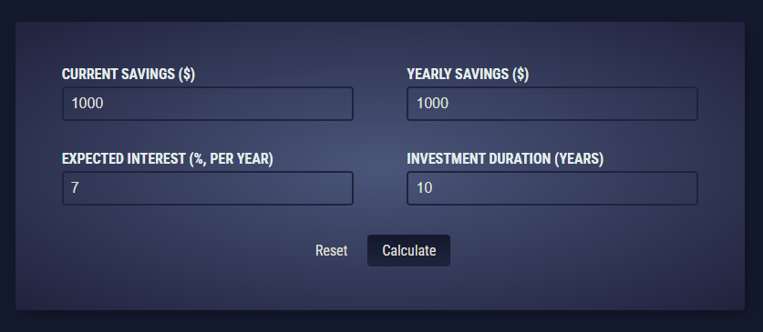

## Investment Calculator
>React app for calculating and displaying investments.

* [User Interface](#investment-calc-user-interface)
* [File Structure](#investment-calc-file-structure)

### <a name="investment-calc-user-interface">User Interface</a>

Main landing page (investment calculator):



Calculating a new investment:



A closer look at the results table:



Resetting calculator to default values:



### <a name="investment-calc-file-structure">File Structure</a>
```
investment-calculator/
├── public/
    ├── index.html
    ├── favicon.ico
    ├── manifest.json
    └── robots.txt
├── src/
    ├── assets/
    |   ├── images/
    |   |   ├── ui-1.png
    |   |   ├── ui-2.png
    |   |   ├── ui-3.png
    |   |   ├── ui-4.png
    ├── components/
    |   ├── Header/
    |   |   ├── Header.js
    |   |   ├── Header.module.css
    |   ├── ResultsTable/
    |   |   ├── ResultsTable.js
    |   |   ├── ResultsTable.module.css
    |   ├── UserInput/
    |   |   ├── UserInput.js
    |   |   ├── UserInput.module.css
    ├── App.js
    ├── index.css
    ├── index.js
├── .gitignore
├── package.json
├── readme.md
```

<kbd> <br> [Back to Top](#investment-calculator) <br> </kbd>
---