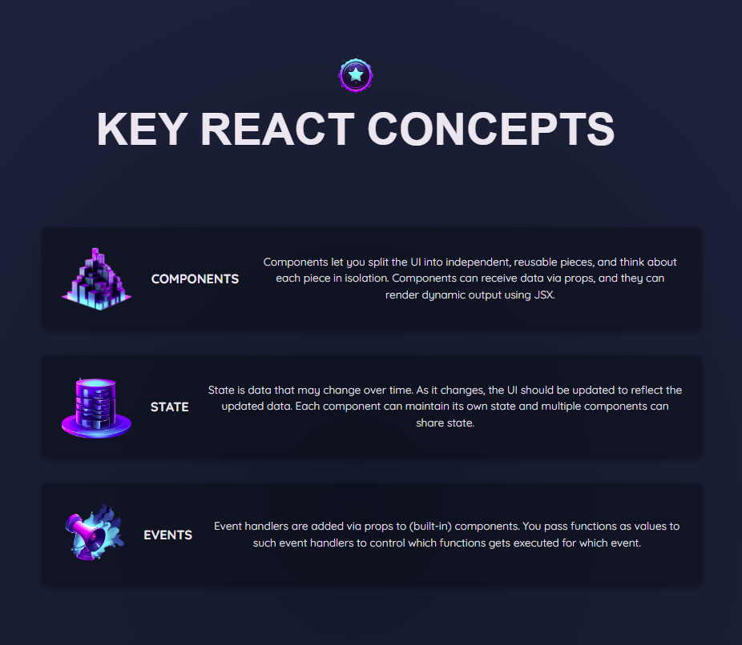
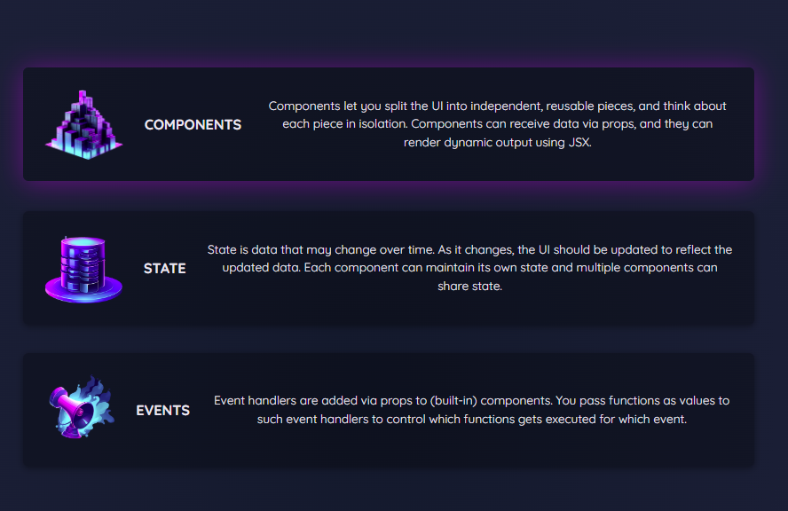

## Key React Concepts
>React app UI for displaying some key React concepts.

* [User Interface](#key-react-concepts-user-interface)
* [File Structure](#key-react-concepts-file-structure)

### <a name="key-react-concepts-user-interface">User Interface</a>

Main landing page:



Concept hover effect:



### <a name="key-react-concepts-file-structure">File Structure</a>
```
key-react-concepts/
├── public/
    ├── index.html
    ├── favicon.ico
    ├── manifest.json
    └── robots.txt
├── src/
    ├── assets/
    |   ├── images/
    |   |   ├── components.png
    |   |   ├── events.png
    |   |   ├── key-concepts.png
    |   |   ├── state.png
    |   ├── UI/
    |   |   ├── ui-1.png
    |   |   ├── ui-2.png
    ├── components/
    |   ├── Concepts/
    |   |   ├── Concepts.js
    |   ├── UI/
    |   |   ├── Header/
    |   |   |   ├── Header.css
    |   |   |   ├── Header.js
    ├── context/
    |   |   ├── auth-context.js
    ├── App.js
    ├── index.css
    ├── index.js
├── .gitignore
├── package.json
├── readme.md
```

<kbd> <br> [Back to Top](#key-react-concepts) <br> </kbd>
---
