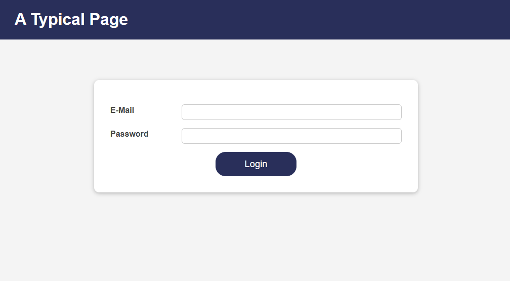
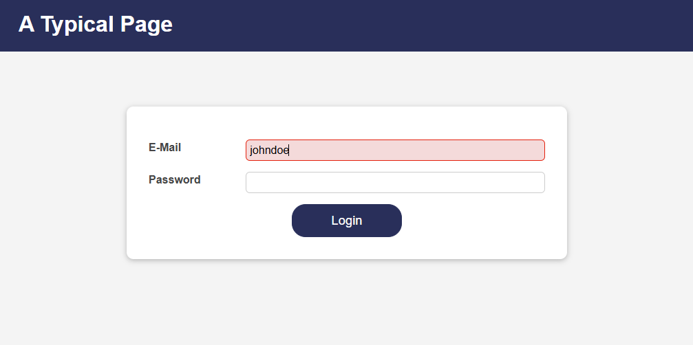
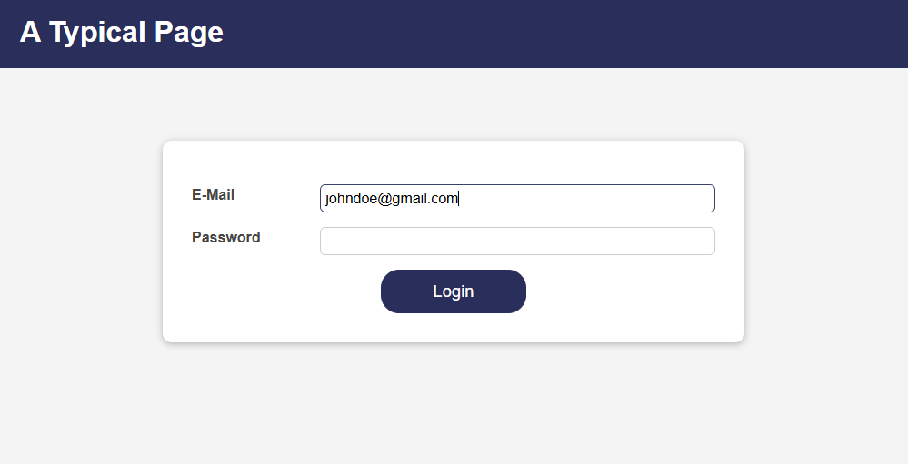

## Login Page UI
>React app for displaying a login page and performing authentication check on login information.

* [User Interface](#login-page-user-interface)
* [Project Structure](#login-page-project-structure)

### <a name="login-page-user-interface">User Interface</a>

Main landing page:



Invalid email input:



Valid email input:



### <a name="login-page-file-structure">Project Structure</a>
```
login-page-ui/
├── public/
    ├── index.html
    ├── favicon.ico
    ├── manifest.json
    └── robots.txt
├── src/
    ├── assets/
    |   ├── images/
    |   |   ├── ui-1.png
    |   |   ├── ui-2.png
    |   |   ├── ui-3.png
    ├── components/
    |   ├── Home/
    |   |   ├── Home.js
    |   |   ├── Home.module.css
    |   ├── Login/
    |   |   ├── Login.js
    |   |   ├── Login.module.css
    |   ├── MainHeader/
    |   |   ├── MainHeader.js
    |   |   ├── MainHeader.module.css
    |   |   ├── Navigation.js
    |   |   ├── Navigation.module.css
    |   ├── UI/
    |   |   ├── Button/
    |   |   |   ├── Button.js
    |   |   |   ├── Button.module.css
    |   |   ├── Card/
    |   |   |   ├── Card.js
    |   |   |   ├── Card.module.css
    |   |   ├── Input/
    |   |   |   ├── Input.js
    |   |   |   ├── Input.module.css
    ├── context/
    |   |   ├── auth-context.js
    ├── App.js
    ├── index.css
    ├── index.js
├── .gitignore
├── package.json
├── readme.md
```

<kbd> <br> [Back to Top](#login-page-ui) <br> </kbd>
---